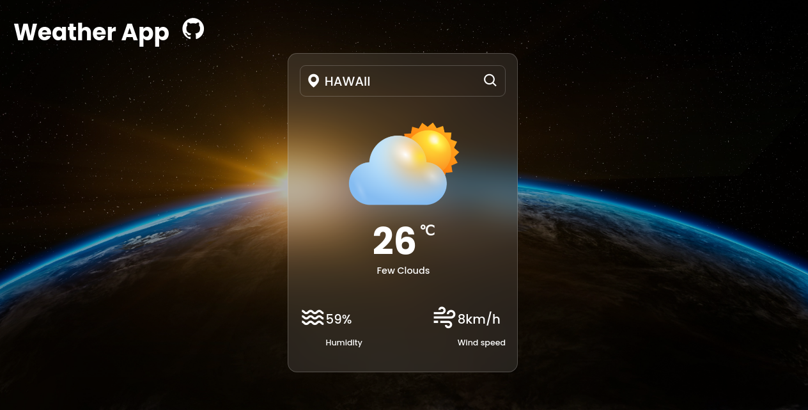

# Weather App

In this project, I created a weather forecast site using the open map weather API.
I got comfortable consuming the API using Async/Await to work with promises using the `fetch` function.



## Built With

- HTML
- JavaScript
- Webpack
- OpenMapAPI

## Live Demo

[Live Demo Link](https://odilsoncode.github.io/weather-app/)

## Getting Started

To get a local copy of the repository please run the following commands on your terminal:

```bash
$ git clone https://github.com/odilsoncode/weather-app.git
$ cd weather-app
$ npm install
$ npm run start
```

## Author

**Italis Odilson Woodly**

- Github: [@odilsoncode](https://github.com/odilsoncode/)
- Twitter: [@odilsoncode](https://twitter.com/odilsoncode)
- Linkedin: [odilsoncode](https://www.linkedin.com/in/odilsoncode/)

## 🤝 Contributing

Contributions, issues and feature requests are welcome!

Feel free to check the [issues page](https://github.com/odilsoncode/weather-app/issues).

## Show your support

Give a ⭐️ if you like this project!
